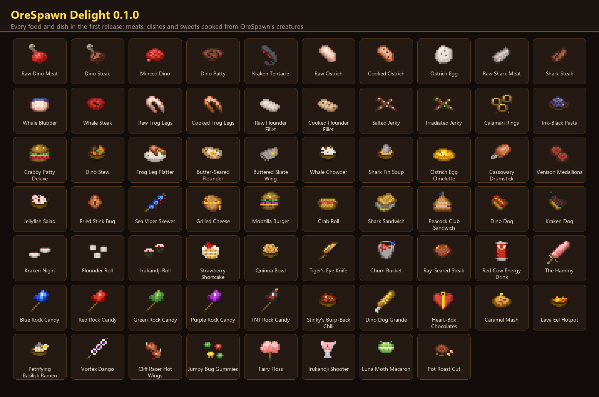

# OreSpawn Delight

A Farmer's Delight kitchen for OreSpawn on NeoForge 1.21.1: real meats, dishes and feasts from the creatures of the OreSpawn world. It's part of the [CrazyCraft 5.0](https://github.com/CoolFreeze23/CrazyCraft-5.0) pack.

## What's in it

- Meats from OreSpawn's creatures: the T-Rex drops dino meat, the Kraken its tentacles and hammerheads shark meat, and whales, ostriches, frogs and flounders give their own cuts.
- Farmer's Delight cooking: cutting board and cooking pot recipes such as Dino Stew, Whale Chowder, Shark Fin Soup, Calamari Rings and Ink-Black Pasta. Warm and hearty dishes give Farmer's Delight's comfort and nourishment.
- Burgers, sandwiches, sushi and sweets: the Mobzilla Burger, Crabby Patty Deluxe, Kraken Nigiri, the Irukandji Roll (eat at your own risk), rock candy and more.
- Placeable feasts: Rex Roast, Mobzilla Feast, Queen's Banquet and Sunday Pot Roast, plus the Yellowcake and the Battle-Tower Cheese Wheel.
- Oddities: a Ray-Seared Steak, cooked by shooting raw beef with the Ray Gun, and Irradiated Jerky, if you like your snacks glowing.
- A cookbook with every recipe, when Patchouli is installed.

## Download

Get the jar from the [Releases](../../releases) page. It needs:

- NeoForge 21.1 for Minecraft 1.21.1
- [OreSpawn for NeoForge 1.21.1](https://github.com/CoolFreeze23/Orespawn)
- [Farmer's Delight](https://modrinth.com/mod/farmers-delight) 1.3 or newer

[Patchouli](https://modrinth.com/mod/patchouli) is optional.

## Building

With JDK 21: `./gradlew build`. The compile-only dependency jars go in `libs/` first (the list is in [libs/README.md](libs/README.md)). The jar lands in `build/libs/`.
